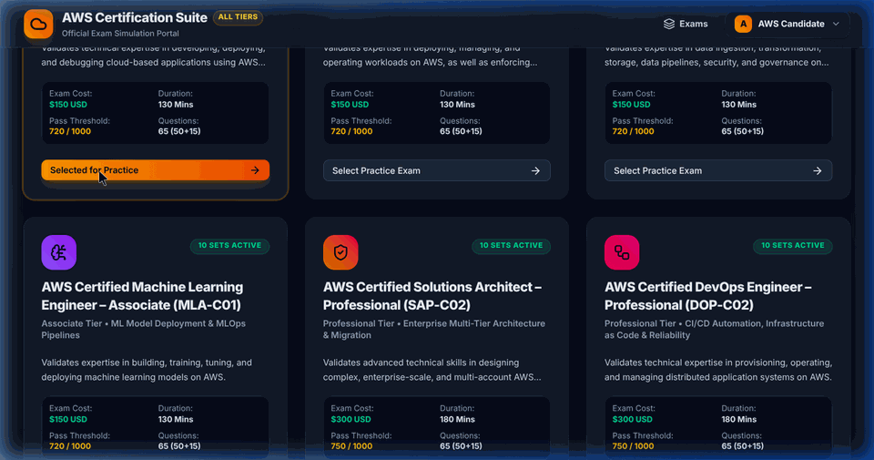

# ☁️ AWS Certification Practice Suite & Exam Guide

A comprehensive, one-stop AWS Certification simulation and learning platform covering **all 12 official AWS Certifications** across **4 Tiers** (Foundational, Associate, Professional, and Specialty).

Featuring authentic **65-question exam simulations**, **50 scored vs 15 experimental beta question splits**, **retake question & option scrambling**, **candidate analytics dashboard**, and **persistent local data storage**.

---

## 🎬 Application Demo & Walkthrough

Below is an animated walkthrough demonstrating exam selection, smooth scrolling, 65-question exam simulation (Mode A instant feedback & Mode B timed sitting), instant explanations with official AWS docs, and candidate analytics with detailed attempt logs:



---

## 🌟 Key Features

### 1. Complete 12 AWS Certification Catalog Across 4 Tiers
Every official AWS certification features **10 full practice exam sets** (65 questions per set, 120 sets total, 7,800 total scenario questions):

- **1. Foundational Tier** ($100 USD | 90 Mins | 0–6 Months Experience):
  - `AWS Certified Cloud Practitioner (CLF-C02)` – 10 Sets
  - `AWS Certified AI Practitioner (AIF-C01)` – 10 Sets
- **2. Associate Tier** ($150 USD | 130 Mins | ~1 Year Experience):
  - `AWS Certified Solutions Architect – Associate (SAA-C03)` – 10 Sets
  - `AWS Certified Developer – Associate (DVA-C02)` – 10 Sets
  - `AWS Certified SysOps Administrator – Associate (SOA-C02)` – 10 Sets
  - `AWS Certified Data Engineer – Associate (DEA-C01)` – 10 Sets
  - `AWS Certified Machine Learning Engineer – Associate (MLA-C01)` – 10 Sets
- **3. Professional Tier** ($300 USD | 180 Mins | 2+ Years Experience):
  - `AWS Certified Solutions Architect – Professional (SAP-C02)` – 10 Sets
  - `AWS Certified DevOps Engineer – Professional (DOP-C02)` – 10 Sets
- **4. Specialty Tier** ($300 USD | 170–180 Mins | 2–5 Years Experience):
  - `AWS Certified Advanced Networking – Specialty (ANS-C01)` – 10 Sets
  - `AWS Certified Security – Specialty (SCS-C02)` – 10 Sets
  - `AWS Certified Machine Learning – Specialty (MLS-C01)` – 10 Sets

---

### 2. Authentic 65-Question AWS Exam Simulation Format
- **50 Scored Questions + 15 Unscored Beta Questions**:
  - Mimics official AWS test center sittings. Your **100–1000 scaled score** is derived strictly from the 50 scored questions.
  - The 15 experimental beta questions are presented seamlessly during the test, with post-exam analytics revealing your performance on both categories.
- **Dual Exam Modes**:
  - **Mode A (Instant Feedback)**: Reveals answer explanations and official AWS documentation links after every question.
  - **Mode B (Full Exam Simulation)**: Real-time countdown timer (90 to 180 minutes) with full scoring breakdown at the end.
- **Fisher-Yates Retake Scrambling**:
  - Automatically shuffles question order AND option presentation keys (A, B, C, D) on every attempt to evaluate true concept mastery.

---

### 3. Dedicated Candidate Analytics Dashboard & Attended Exams Breakdown
- **AWS Exam Readiness Index (0–100%)**: Color-coded readiness badge (`HIGHLY EXAM READY`, `MODERATE READINESS`, `PRACTICE NEEDED`).
- **Attended Exams Details Modal**: Interactive summary card listing all previous exam sittings, date/time timestamps, scaled score (100–1000), scored/unscored question accuracy, time spent, and domain performance breakdown badges.
- **AWS Scaled Score Trajectory Bar Chart**: Visual bar graph displaying performance trends across historical sittings with a dashed **AWS Passing Benchmark line (720 / 1000)**.
- **Domain Accuracy Breakdown**: Horizontal domain mastery progress bars.
- **Personalized Study Suggestions**: Automated recommendations targeting lower-accuracy domains (<75%).
- **Attempt History Log**: Complete historical log table of all previous sittings.

---

### 4. Candidate Profile Management & Top-Right Auth
- Top-right corner **Log In** and **Sign Up** buttons for Guest candidates.
- Candidate Profile pill and dropdown menu with **My Performance Dashboard** and **Log Out (Continue as Guest)** capability.
- Persistent user progress sync with SQLite backend database.

---

## 🚀 How to Run Locally

### 1. Prerequisites
- Node.js (v18+ recommended)
- npm (v9+ recommended)

### 2. Installation
```bash
git clone https://github.com/manujayarajkm/aws-cert-buddy.git
cd aws-cert-buddy
npm install
```

### 3. Start Backend & Frontend Development Servers
- **Start Express Backend API** (Port 4000):
  ```bash
  npm run server
  ```
- **Start Vite Frontend App** (Port 3000):
  ```bash
  npm run dev
  ```
- Open your browser at `http://localhost:3000`.

### 4. Run Unit Tests
```bash
npm test
```

---

## 🐳 Running with Docker & Docker Compose

You can containerize and run the complete application using Docker Compose:

### 1. Build and Start Container
```bash
docker compose up --build -d
```

### 2. Access Application
Open your browser at `http://localhost:4000`.

### 3. Stop Container
```bash
docker compose down
```

---

## ➕ How to Add New Question Sets via JSON

The platform features an automated dynamic loader (`src/engine/questionLoader.ts`) powered by Vite eager glob imports. **You can add new practice or simulation sets simply by dropping a new JSON file into the data folder—no code modifications or manual registration required!**

### 1. File Placement & Naming Conventions
Navigate to `src/data/<exam-code-lowercase>/` for your target certification (e.g., `src/data/dva-c02/` or `src/data/saa-c03/`):

- **Practice Mode Sets (Mode A)**: Name the file `set-<number>.json` (e.g., `set-11.json`).
- **Simulation Mode Sets (Mode B)**: Name the file `sim-set-<number>.json` (e.g., `sim-set-11.json`).

---

### 2. JSON Question Structure Schema
Each JSON file must contain a JSON array of `Question` objects. Below is a sample schema for a question:

```json
[
  {
    "id": "dva-c02-s11-q1",
    "setId": 11,
    "examCode": "DVA-C02",
    "domainId": "dva-d1",
    "domainName": "Domain 1: Development with AWS Services",
    "questionType": "single",
    "selectCount": 1,
    "isScored": true,
    "scenario": "A developer is writing an e-commerce application using Amazon DynamoDB. The application needs to perform atomic updates across multiple order and inventory tables in an all-or-nothing transaction. Which DynamoDB API operation should be used?",
    "codeSnippet": "aws dynamodb transact-write-items --transact-items file://items.json",
    "options": [
      { "id": "A", "text": "TransactWriteItems" },
      { "id": "B", "text": "BatchWriteItem" },
      { "id": "C", "text": "PutItem with ConditionExpression" },
      { "id": "D", "text": "UpdateItem with ReturnValues" }
    ],
    "correctAnswer": ["A"],
    "explanation": "TransactWriteItems enables atomic, coordinated write operations across multiple items within and across DynamoDB tables.",
    "awsDocUrl": "https://docs.aws.amazon.com/amazondynamodb/latest/developerguide/transactions.html",
    "difficulty": "Standard"
  }
]
```

#### Field Specifications:
- `id`: *(string)* Unique identifier (e.g., `dva-c02-s11-q1` or `dva-c02-sim-s11-q1`).
- `setId`: *(number)* The numeric set number matching your filename (e.g., `11`).
- `examCode`: *(string)* Exam identifier (e.g., `"CLF-C02"`, `"AIF-C01"`, `"SAA-C03"`, `"DVA-C02"`, `"SOA-C02"`, `"DEA-C01"`, `"MLA-C01"`, `"SAP-C02"`, `"DOP-C02"`, `"ANS-C01"`, `"SCS-C02"`, `"MLS-C01"`).
- `domainId` & `domainName`: *(string)* Official AWS exam blueprint domain.
- `questionType`: *(string)* `"single"` for single-choice radio buttons or `"multiple"` for multi-select checkboxes.
- `selectCount`: *(number)* Number of options candidate must select (`1` for single, `2` or `3` for multiple choice).
- `isScored`: *(boolean)* `true` for Scored questions (Q1–Q50), `false` for Experimental Beta questions (Q51–Q65).
- `scenario`: *(string)* The full scenario stem.
- `codeSnippet`: *(string, optional)* Code or CLI command snippet.
- `options`: *(array)* List of choices with `id` (`"A"`, `"B"`, `"C"`, `"D"`, `"E"`) and `text`.
- `correctAnswer`: *(array of strings)* Array of correct option IDs (e.g., `["A"]` or `["A", "B"]`).
- `explanation`: *(string)* Detailed explanation revealed in Mode A or post-exam review.
- `awsDocUrl`: *(string)* Link to official AWS Documentation.
- `difficulty`: *(string)* `"Standard"`, `"Challenging"`, or `"Complex"`.

---

### 3. Automatic Discovery & Zero Rebuild Required
Once the `.json` file is saved inside `src/data/<exam-dir>/`, Vite's eager glob import automatically discovers and parses the set on next application load or hot-reload. The UI set selector in `ExamSelector.tsx` will automatically render the new set button for candidates!

---

## 🛠️ Tech Stack

- **Frontend**: React 19, TypeScript, Vite, Tailwind CSS, Lucide React Icons, Canvas Confetti.
- **Backend API**: Node.js, Express 5.x.
- **Database / Persistence**: Better-SQLite3, persistent file database stored in `./db/aws_exam_guide.db`.
- **Testing**: Vitest, React Testing Library.
- **Containerization**: Multi-stage Dockerfile, Docker Compose.

---

## 📄 License

This project is licensed under the **MIT License**.

---

## 💖 Author & Credits

Made with ❤️ from **[Manu Jayaraj](https://github.com/manujayarajkm/aws-cert-buddy)**.
